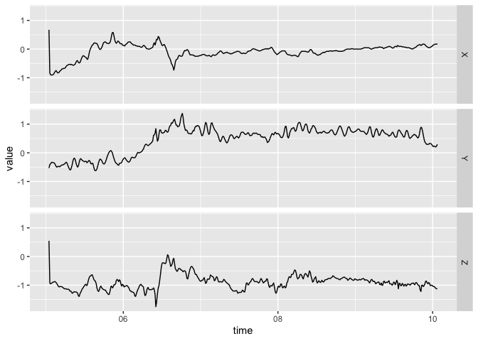

<!-- README.md is generated from README.Rmd. Please edit that file -->

# bis620.2022

[](https://github.com/cxin88/bis620.2022/actions/workflows/R-CMD-check.yaml)
[](https://github.com/cxin88/bis620.2022/actions/workflows/lint.yaml)
[](https://github.com/cxin88/bis620.2022/actions/workflows/test-coverage.yaml)

## Installation

You can install the development version of bis620.2022 from
[GitHub](https://github.com/cxin88/bis620.2022) with: <br>
`install.packages("devtools")` <br>
`devtools::install_github("cxin88/bis620.2022")`

## Description with examples

The bis620.2022 package is a new package in R, created for the BIS620
class. To use this package, you need to use the “usethis”, and
“devtools” packages. This package mainly works with the Synthesized
UKBiobank Accelerometry Data, where it includes the time measurement,
and the acceleration in the XY and Z direction; this dataset is called
“ukb_accel”. Here is a sneak peak at the dataset:

``` r
library("usethis")
library("devtools")
document()
#> ℹ Updating bis620.2022 documentation
#> ℹ Loading bis620.2022
library("bis620.2022")
data(ukb_accel)
ukb_accel
#> # A tibble: 1,080,000 × 4
#>    time                     X      Y      Z
#>    <dttm>               <dbl>  <dbl>  <dbl>
#>  1 2017-03-13 10:00:05  0.672 -0.531  0.547
#>  2 2017-03-13 10:00:05 -0.844 -0.406 -0.922
#>  3 2017-03-13 10:00:05 -0.891 -0.391 -0.953
#>  4 2017-03-13 10:00:05 -0.906 -0.344 -0.938
#>  5 2017-03-13 10:00:05 -0.906 -0.328 -0.922
#>  6 2017-03-13 10:00:05 -0.891 -0.344 -0.891
#>  7 2017-03-13 10:00:05 -0.875 -0.344 -0.891
#>  8 2017-03-13 10:00:05 -0.828 -0.359 -0.875
#>  9 2017-03-13 10:00:05 -0.781 -0.406 -0.875
#> 10 2017-03-13 10:00:05 -0.75  -0.469 -0.906
#> # … with 1,079,990 more rows
```

One function of this package is “spectral_signature” which gets the
spectral signature of the dataset. Here is a brief example of what the
functino looks like when used on the “ukb_accel” dataset.

``` r
spectral_signature(ukb_accel[1:500, ])
#> # A tibble: 250 × 4
#>        X      Y      Z  freq
#>    <dbl>  <dbl>  <dbl> <dbl>
#>  1 37.3  223.   447.   0.199
#>  2  4.45 119.    26.5  0.200
#>  3 29.9   87.7   34.2  0.201
#>  4 50.3   37.9   35.8  0.202
#>  5 26.1   18.0   22.3  0.202
#>  6 22.5   24.0   19.4  0.203
#>  7 17.6   20.8   21.5  0.204
#>  8 19.5   10.7    6.52 0.205
#>  9  3.62   5.19  10.0  0.206
#> 10  6.00  15.5   28.2  0.207
#> # … with 240 more rows
```

The “accel_plot” is another function in this package. This function is
supposed to return a time-series function from the data. Due to its
time-series output, this function requires either a “time” input column
or a “frequency” column. Here is an example of the “accel_plot” function
on the ukb_accel dataset (with time), and also an example of it with the
spectral_signature function applied (with frequency).

``` r
ukb_accel[1:500, ] |>
  accel_plot()
```


